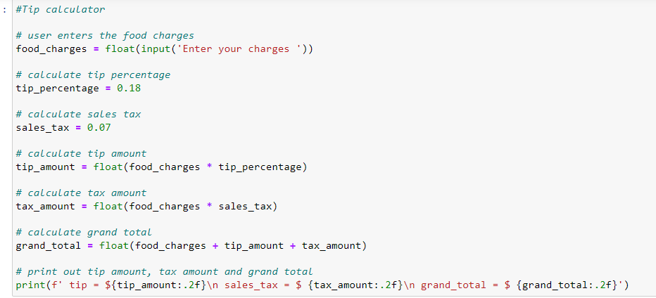
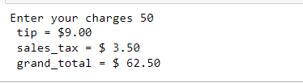

# A-simple-python-program

## Project Description ✨
This is a simple python program called Tip Calculator.
It calculates the total amount of meal purchased with a fixed tip.

## Codes for the program

### Output of the program

## The above is a simple python program. 🙂